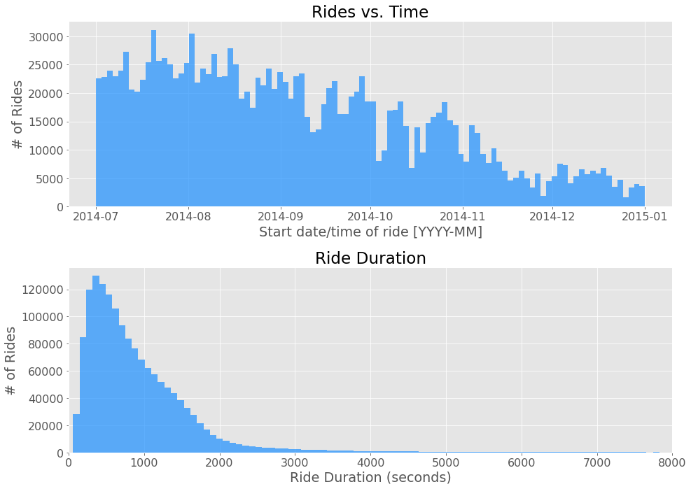
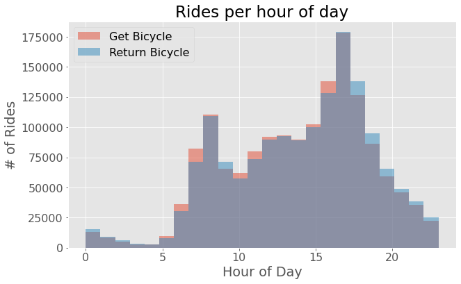
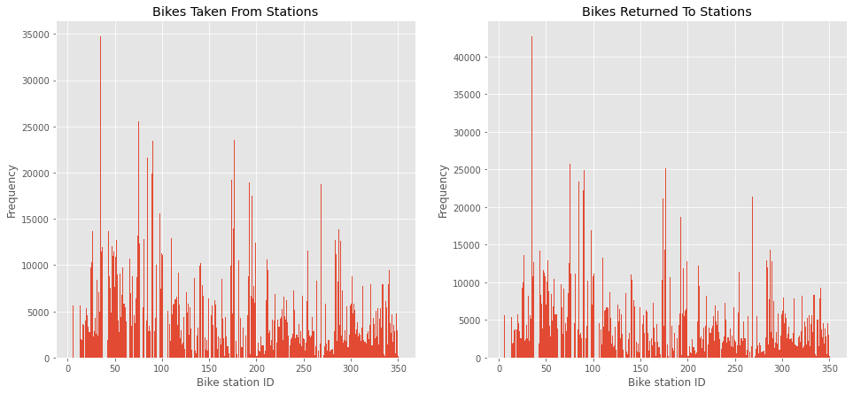
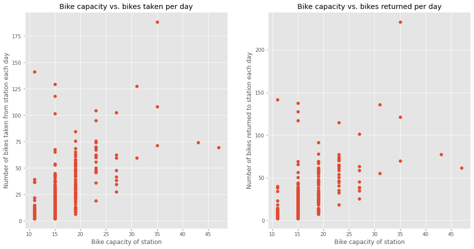
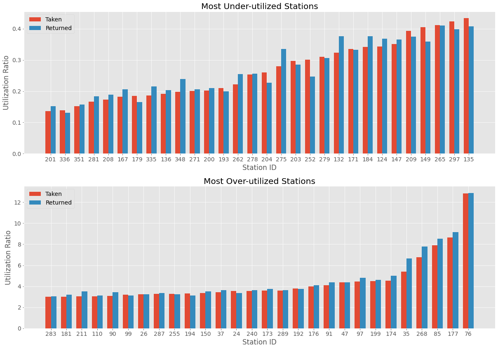

# Bike Dock Capacity Case Study

The goal of this case study was to determine whrere to install more bike docks at bike docking stations, and which stations already have more than enough bike docks and do not need any additional docks installed. To do this, I wanted to identify stations where bike dock capacity was over-utilized, and stations where capacity was under-utilized.

### Data Pre-Processing and Cleaning

I first loaded the station data and trips data from separate CSV files. There were 3 files for trips data, one for Q3-07, one for Q3-07 and -08, and one for Q4. I merged these into one dataframe before beginning data analysis. After loading the station and trips data, I examined the data for null values. All of the columns of interest to this case study were non-null, only gender and birth year had null values because these were only available for subscribers. 

Next, I cleaned up the start-times and stop-times in trips dataset. I converted start-times and stop-times to Pandas datetime format, and then created additional columns for start-day, stop-day, start-hour, and stop-hour for data analysis and plotting purposes.

### Exploratory Data Analysis

After cleaning and pre-processing the data, I began exploratory data analysis to inform my goal of determining underutilized and over-utilized bike stations.

I plotted rides vs. time and trip distance to get a sense of ride trends over time:

 

I also plotted rides per hour of the day, to see whether commuting was a factor in bike rentals. Indeed, we can see from the plot that around 5-9 am each day there are more people taking bicycles than returning them, then a lull in the middle of the day where many people returned their bikes after getting to work, and then an increase in taking bikes around 3-4pm and an increase in returning bikes after returning home for the day from 5-12pm:

 

To investigate whether bikes taken from stations had a similar rate of return to the same stations, I plotted the frequency of bikes taken from each station to bikes returned to each station. Rates of taking bicycles vs. returning bicycles seem very correlated based on this plot. 

 

### Calculating Average Use of Bikes Per Day at Each Station

After conducting exploratory data analysis, I decided that the best way to determine over-utilization or under-utilization of bikes was to group the trips data by station, and then by day, and then average the number of bikes taken from and returned to the station each day. I would then compare the bike capacity of each station with the number of bikes taken and returned each day, and calculate the ratio of bikes taken and returned to bike dock capacity.

Below is a plot of bike capacity vs. bikes taken at each station, and bike capacity vs. bikes returned at each station. We can see that there are several outliers on these plots, where bike station capacity is much higher or lower than bikes taken each day. 

 

I calculated two sets of utilization ratios:
1. Bikes taken per day divided by bike dock capacity
2. Bikes returned per day divided by bike dock capacity

I then took the top 10% and the bottom 10% of each list, so that I had the 10% most over-utilized stations of bikes taken, the 10% most over-utilized stations of bikes returned, the 10% most under-utilized stations of bikes taken, and the 10% most under-utilized stations of bikes taken. After these lists were calculated, I calculated the intersection of the two over-utilization lists and the intersection of the two under-utilization lists. The plot below shows the most under-utilized stations and the most over-utilized stations using this method:

 

Here are the names of the most under-utilized and most over-utilized stations:
```
The stations with the lowest utilizations are: 'Indiana Ave & 40th St', 'Cottage Grove Ave & 47th St',
'Cottage Grove Ave & 51st St', 'Western Ave & 24th St', 'Ashland Ave & 21st St', 'Damen Ave & Coulter St',
'MLK Jr Dr & Oakwood Blvd', 'Calumet Ave & 35th St', 'Racine Ave & 13th St', 'California Ave & 21st St',
'Cottage Grove Ave & 43rd St', 'MLK Jr Dr & 47th St', 'State St & 29th St', 'Halsted St & 37th St', 
'Wallace Ave & 35th St', 'Prairie Ave & Garfield Blvd', 'Ashland Ave & 13th St', 'Western Ave & 21st St',
'Greenwood Ave & 47th St', 'Halsted St & 35th St','Wentworth Ave & 24th St', 'May St & Cullerton St', 
'State St & 35th St', 'Damen Ave & Cullerton St', 'Indiana Ave & 26th St', 'Normal Ave & Archer Ave',
'Calumet Ave & 33rd St', 'Cottage Grove Ave & Oakwood Blvd', 'Paulina St & Montrose Ave', 'Halsted St & 21st St'

The stations with the highest utilizations are: 'LaSalle St & Jackson Blvd', 'LaSalle St & Illinois St',
'St Clair St & Erie St', 'State St & Erie St','Millennium Park', 'Lake Shore Dr & Ohio St', 'McClurg Ct & Illinois St',
'Franklin St & Arcade Pl', 'Indiana Ave & Roosevelt Rd', 'Wabash Ave & Wacker Pl','Fort Dearborn Dr & 31st St',
'Dearborn St & Adams St', 'Fairbanks Ct & Grand Ave', 'Sheridan Rd & Irving Park Rd', 'Mies van der Rohe Way & Chicago Ave',
'Wells St & Concord Ln', 'Canal St & Adams St', 'Clark St & Elm St', 'Clinton St & Washington Blvd', 'State St & Kinzie St',
'Museum Campus', 'Wabash Ave & Grand Ave', 'Canal St & Madison St', 'Streeter Dr & Illinois St', 
'Lake Shore Dr & North Blvd', 'Michigan Ave & Oak St', 'Theater on the Lake','Lake Shore Dr & Monroe St'
```
